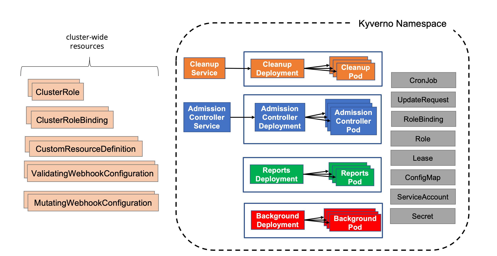

# Demo-kyverno

## Summary

kyverno is a kubernetes Native Policy Management. It is good for 
an extra but necessary reinforcment to manage our environment and our 
"little pets". [More Info](https://kyverno.io/)


## kyverno Deployment

The diagram below shows a typical Kyverno installation featuring all available controllers.

[](img/kyverno-installation.png)

### Install Kyverno using YAMLs

Kyverno can also be installed using a single installation manifest, however for production 
installations the Helm chart is the preferred and recommended method. But for test and demo 
this method is perfect...

```
kubectl create -f https://github.com/kyverno/kyverno/releases/download/v1.10.0/install.yaml
```

## The example scenarios

### World famous block-nodeport

```
kubectl apply -f src/policies/restrict-node-port.yaml
```
Deploy example app:
```
kubectl apply -f src/app/app.yaml
```
Output:
```
deployment.apps/demo-kyverno created
ingress.networking.k8s.io/demo-kyverno created
Error from server: error when creating "src/app/app.yaml": admission webhook "validate.kyverno.svc-fail" denied the request: 

resource Service/default/demo-kyverno was blocked due to the following policies 

restrict-nodeport:
  restrict-nodeport: 'validation error: Services of type NodePort are not allowed.
    rule restrict-nodeport failed at path /spec/type/'
```

### Require Ingress HTTPS

```
kubectl apply -f src/policies/require-ingress-https.yaml
```
Deploy example app:
```
kubectl apply -f src/app/app.yaml
```
Output:
```
deployment.apps/demo-kyverno created
service/demo-kyverno created
Error from server: error when creating "src/app/app.yaml": admission webhook "validate.kyverno.svc-fail" denied the request: 

resource Ingress/default/demo-kyverno was blocked due to the following policies 

require-ingress-https:
  has-annotation: 'validation error: The kubernetes.io/ingress.allow-http annotation
    must be set to false. rule has-annotation failed at path /metadata/annotations/kubernetes.io/ingress.allow-http/'
  has-tls: TLS must be defined.
```

### Deny Image Latest Tag

```
kubectl apply -f src/policies/disallow-specific-version-tag.yaml
```
Deploy example app:
```
kubectl apply -f src/app/app.yaml
```
Output:
```
service/demo-kyverno created
ingress.networking.k8s.io/demo-kyverno created
Error from server: error when creating "src/app/app.yaml": admission webhook "validate.kyverno.svc-fail" denied the request: 

resource Deployment/default/demo-kyverno was blocked due to the following policies 

disallow-latest-tag:
  autogen-validate-image-tag: 'validation error: Using a mutable image tag e.g. ''latest''
    is not allowed. rule autogen-validate-image-tag failed at path /spec/template/spec/containers/0/image/'
```